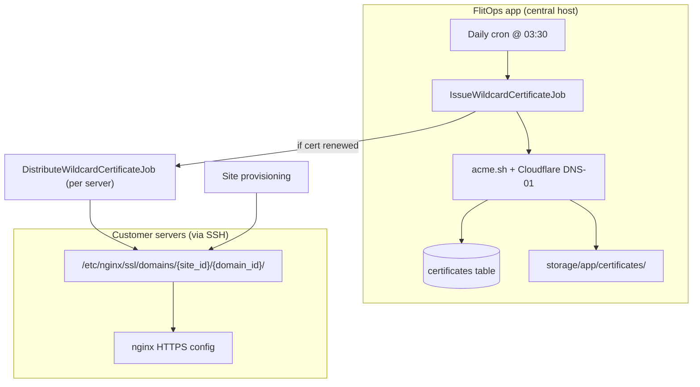

# Free SSL — How It Works

FlitOps gives every site on the **free domain** (e.g. `mysite.flitops.xyz`) HTTPS using **one shared Let's Encrypt wildcard certificate** for `*.flitops.xyz`. Custom domains are not covered yet — only hostnames ending in `.{FREE_DOMAIN}`.

The design has three layers: **issue once centrally**, **store metadata in the DB**, **copy cert files to each server** where nginx expects them.

---

## The Big Picture



---

## 1. What "free SSL" means here

When a user creates a site **without** a custom domain, FlitOps assigns `{site_name}.{FREE_DOMAIN}`:

- DNS: an A record is created in Cloudflare pointing to the server IP.
- SSL: the site uses the **shared wildcard cert** `*.{FREE_DOMAIN}` — not a per-site cert.

Custom domains get HTTP-only nginx configs for now. SSL is only turned on when the hostname ends with the free domain **and** a valid wildcard cert exists in the database.

---

## 2. Issuing the certificate (central, on the FlitOps host)

This runs on the machine that runs queue workers — **not** on customer servers.

**Tooling:** [acme.sh](https://github.com/acmesh-official/acme.sh) + Let's Encrypt + **Cloudflare DNS-01** challenge (needed for wildcards).

**Flow:**

1. `IssueWildcardCertificateJob` runs daily at 03:30 (also triggerable via `php artisan flitops:wildcard:issue`).
2. `WildcardCertificateIssuer::issueOrRenew('*.flitops.xyz')` checks the `certificates` table.
3. If a cert exists and is **not** within 30 days of expiry → **no-op** (idempotent).
4. Otherwise acme.sh runs with Cloudflare credentials (`CF_Token`, `CF_Zone_ID`) to prove domain control via DNS.
5. Files land under `storage/app/certificates/`; metadata (paths, expiry, `last_renewed_at`) is saved in `certificates`.

**Required env vars:** `CLOUDFLARE_API_TOKEN`, `CLOUDFLARE_ZONE_ID`, `FREE_DOMAIN`, and acme.sh installed on the FlitOps host.

---

## 3. Getting the cert onto servers

Nginx expects cert files at a **Forge-style path** per site/domain:

```
/etc/nginx/ssl/domains/{site_id}/{domain_id}/server.crt
/etc/nginx/ssl/domains/{site_id}/{domain_id}/server.key
```

Every free-domain site gets a **copy** of the same wildcard cert at its own path (same cert, different folders).

### Path A — New site provisioning (synchronous)

When `CreateSiteJob` provisions a site, during the **Configure Nginx** step:

1. For each free-domain hostname, `SyncWildcardCertificateForDomainAction` SSH-uploads cert + key (if they differ from what's already on the server — hash check).
2. Then `SiteNginxSyncService` writes nginx config, runs `nginx -t`, and reloads.

Certs must exist **before** `nginx -t`, or provisioning fails.

### Path B — Renewal fan-out (async)

When the issuance job **actually renews** the cert (`last_renewed_at` changes):

1. It finds every server with at least one free-domain site.
2. Dispatches `DistributeWildcardCertificateJob` per server.
3. That job uploads certs for all free-domain domains on that server, then reloads nginx if anything changed.

New sites do **not** use the distribute job — provisioning handles it inline.

---

## 4. How nginx decides to use SSL

`NginxConfigService::generateForSiteDomainAuto()` picks the config variant:

| Condition | Config |
|-----------|--------|
| Hostname is **not** `*.{FREE_DOMAIN}` | HTTP only (port 80) |
| Free-domain hostname **but** no valid cert in DB | HTTP only |
| Free-domain hostname **and** non-expired wildcard cert | HTTPS (443) + HTTP→HTTPS redirect + HSTS |

The SSL config points at the per-site paths above. The generator doesn't care whether the cert is wildcard-shared or per-domain — same layout either way.

### SSL gate vs on-disk cert (per server)

The SSL decision is **centralized**: `NginxConfigService::shouldUseSsl()` only checks that a `Certificate` row exists for `*.{FREE_DOMAIN}` and that `expires_at` is in the future. It does **not** verify that the cert files are present on the server being configured.

That is intentional and safe in normal operation:

- **Provisioning** syncs cert files synchronously *before* nginx config is written and `nginx -t` runs, so a brand-new site never gets an HTTPS config without local files.
- **Renewal** updates the DB first, then fans out `DistributeWildcardCertificateJob` to each server. If distribution fails for one server, its nginx config still references the **previous** cert on disk — which remains valid until that cert actually expires.

The edge case to watch: a server that misses a renewal distribution will keep serving HTTPS with the old cert until it expires (~90 days). Monitor distribution job failures (and `last_distribution_at` on the certificate row) so lagging servers are caught well before expiry.

---

## 5. End-to-end: user creates a free-domain site

1. **Create site** — User picks a site name; domain becomes `mysite.flitops.xyz`.
2. **DNS** — Cloudflare A record → server IP.
3. **Queue** — `CreateSiteJob` provisions over SSH (dirs, nginx, git clone, etc.).
4. **Cert sync** — Wildcard cert copied to `/etc/nginx/ssl/domains/{site_id}/{domain_id}/`.
5. **Nginx** — SSL config generated and enabled; site is live on HTTPS.

If no wildcard cert exists yet (first deploy before bootstrap), the site gets HTTP-only until someone runs `php artisan flitops:wildcard:issue` and provisioning/nginx sync runs again.

---

## 6. Renewal lifecycle

| When | What happens |
|------|----------------|
| Daily @ 03:30 | Check if cert needs renewal (missing / expired / ≤30 days left) |
| Cert still fresh | Job exits early; no acme.sh, no distribution |
| Cert renewed | acme.sh re-issues → DB updated → distribute job per affected server |
| On each server | Upload new cert files where hashes differ → `nginx -t` → reload |

---

## 7. Key design choices (why it's built this way)

- **One wildcard cert for all free subdomains** — Cheap and simple; Let's Encrypt allows one `*.domain` instead of thousands of per-subdomain certs.
- **DNS-01 via Cloudflare** — HTTP-01 can't validate wildcards; FlitOps already controls the free domain in Cloudflare.
- **Central issuance, distributed files** — acme.sh runs only on FlitOps; customer servers just receive files over SSH.
- **Per-site cert paths** — Matches Laravel Forge's layout so nginx config stays uniform and custom-domain SSL can reuse the same paths later.
- **Idempotent everywhere** — Renewal window, hash checks before upload, and "only distribute if cert actually changed" avoid unnecessary work.

---

## Mental model for a newcomer

> FlitOps owns `*.flitops.xyz` in Cloudflare. Once a day it asks Let's Encrypt for one wildcard certificate using DNS proof. That cert lives on the FlitOps server and in the database. Whenever a free-domain site is provisioned — or when the cert is renewed — FlitOps SSHs into each app server and drops a copy of that cert where nginx expects it, then turns on HTTPS for those hostnames automatically.
